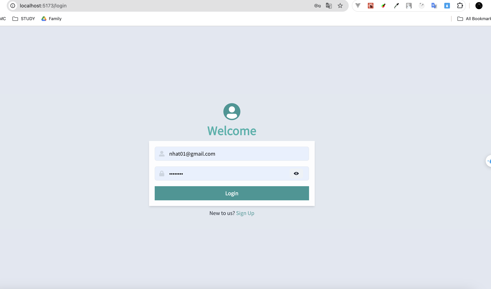
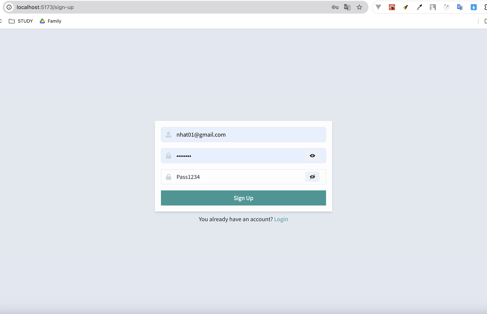
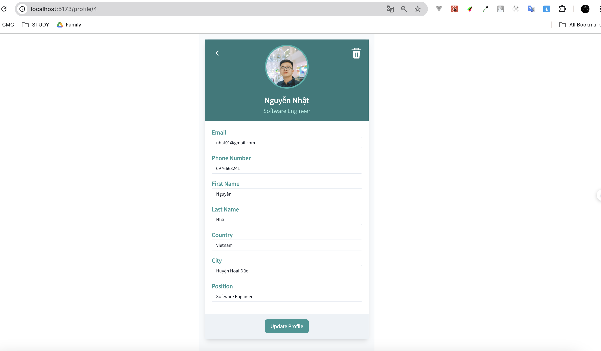

# Socotec assignment

Minimized application for updating user's profile.

Goal: Develop a RESTful API and create UI that allows users to login, register and update their profile

## Installation

- Make sure your local device has already installed Docker
- Please open terminal or shell at root path of sourcecode

Quickstart app command line:

```bash
docker compose up
```

Re-build and reboot app command line:

```bash
docker compose up --build
```

If you wanna run unit testing, please jump into backend to install all packages first:

```bash
cd backend # Jump into the backend terminal
npm install --force
npm run test
```

## Pages

- http://localhost:5173/login
- http://localhost:5173/sign-up
- http://localhost:5173/profile/1

## Preview





## Environments

| Name           | Link                                           |
| -------------- | ---------------------------------------------- |
| Local frontend | [http://localhost:5173](http://127.0.0.1:5173) |
| Local backend  | [http://localhost:3002](http://127.0.0.1:3002) |

## Project Tech Stack

- [Typescript](https://www.typescriptlang.org/) TypeScript is JavaScript with syntax for types.
- [ExpressJS](https://expressjs.com/) Fast, unopinionated, minimalist web framework for Node.js.
- [ReactJS](https://react.dev/) React lets you build user interfaces out of individual pieces called components.
- [ChakraUI](https://www.chakra-ui.com/) Chakra UI is a component system for building products with speed.
- [ReactHookForm](https://react-hook-form.com/) Performant, flexible and extensible forms with easy-to-use validation.
- [PostgreSQL](https://www.postgresql.org/) The World's Most Advanced Open Source Relational Database.

## Project Contributors

| Name          | Email                                            |
| ------------- | ------------------------------------------------ |
| Nathan Nguyen | [nhatguitarfs@gmail.com](nhatguitarfs@gmail.com) |
